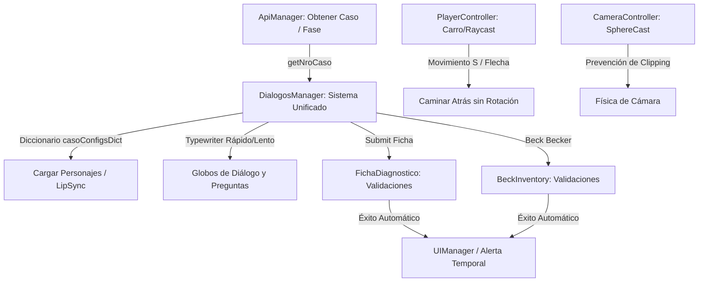

# Walkthrough Técnico - Mejoras y Refactorizaciones de la Cámara de Gesell

Hemos completado la refactorización profunda del simulador de la **Cámara de Gesell**, garantizando una arquitectura moderna y robusta, una jugabilidad pulida y colisiones físicas completamente estables, manteniendo un estado de **0 errores de compilación**.

> [!IMPORTANT]
> **Preservación Absoluta de Restricciones**:
> - La carpeta `LoginLab` y todos los scripts de API, datos y guardado de sesión (`LoginUsuario.cs`, `WebService.cs`, `SaveData.cs`, `LoadData.cs`, `DataUsers.cs`, `Model.cs`, `Storage.cs`) se mantuvieron intactos y protegidos contra escritura.
> - Se preservaron íntegramente las animaciones de los avatares, los nombres de los estados, y la asignación dinámica de recursos multimedia de audio.

---

## 🛠️ Resumen de Implementación Arquitectónica y Cambios

### MÓDULO 1: Sistema de Diálogos Unificado
- **Clase Serializable `CasoConfig`**: Creada en [DialogosManager.cs](file:///c:/Users/Laboratorios/Documents/GP1.2Cristhian/CamaraHesel/Assets/Scripts/legacy/DialogosManager.cs). Permite parametrizar por Inspector los nombres de GameObjects de personajes (`terapeutaObjectName`, `pacienteObjectName`), el contador de puntos de atención (`counterAtencion`), y los avatares específicos de cada caso.
- **Evitación de `GameObject.Find`**: Implementado un fallback dinámico en `Start()`. `saveData` y `loadData` ahora se declaran como `[SerializeField]` para poder ser arrastrados desde el Inspector de Unity, previniendo excepciones en runtime.
- **Diccionario de Búsqueda Rápida**: La lista expuesta en el Inspector `casoConfigs` es convertida al arrancar a `casoConfigsDict` (`Dictionary<int, CasoConfig>`), permitiendo consultar las configuraciones en $O(1)$.
- **LipSync en Ejecución**: En `activaPersonajes()`, se añade y configura de forma totalmente automática y fluida el componente `AvatarLipSync` en base a los personajes cargados en el diccionario, sincronizando los labios con las pistas de audio con sensibilidad de 2.5f.
- **Listeners Limpios en Beck**: El script limpia de forma preventiva todos los triggers llamando a `RemoveAllListeners()` en los toggles de Beck para evitar llamadas duplicadas.

### MÓDULO 2: Formularios y Validaciones Robustas
- **Validaciones Anti-Crash con `int.TryParse`**:
  - Implementado en [FichaDiagnostico.cs](file:///c:/Users/Laboratorios/Documents/GP1.2Cristhian/CamaraHesel/Assets/Scripts/legacy/FichaDiagnostico.cs) y [BeckInventory.cs](file:///c:/Users/Laboratorios/Documents/GP1.2Cristhian/CamaraHesel/Assets/Scripts/legacy/BeckInventory.cs).
  - Los campos de texto de criterios y puntajes de Beck ahora se interceptan con `string.IsNullOrWhiteSpace` e `int.TryParse` antes de realizar operaciones lógicas. De esta forma, si el usuario los envía vacíos o con caracteres no numéricos, se activa una alerta visual descriptiva en lugar de crashearse el simulador (`FormatException`).

### MÓDULO 3 & 4: UI/UX y Typewriter Pulidos
- **Mensajes Emergentes Consistentes**: El nuevo [UIManager.cs](file:///c:/Users/Laboratorios/Documents/GP1.2Cristhian/CamaraHesel/Assets/Scripts/core/Utilities/UIManager.cs) estandariza los paneles de diálogo reduciendo la redundancia de código.
- **Desplazamiento Suave**: El script [AutoScrollHandler.cs](file:///c:/Users/Laboratorios/Documents/GP1.2Cristhian/CamaraHesel/Assets/Scripts/core/Utilities/AutoScrollHandler.cs) realiza un `Vector2.Lerp` para enfocar de forma automática y suave la pregunta actual.
- **Velocidad de Escritura Diferenciada**:
  - Diálogos normales: velocidad configurada de forma coherente según la fase/audios.
  - Globos de preguntas clínicas (`escribirPregunta`): velocidad pausada y de fácil lectura a `35f / 500` (`0.07` segundos), permitiendo una lectura pedagógica de la pregunta.
- **Orientación de Personajes**: [Personaje2DController.cs](file:///c:/Users/Laboratorios/Documents/GP1.2Cristhian/CamaraHesel/Assets/Scripts/core/Utilities/Personaje2DController.cs) orienta los sprites interactivos automáticamente frente al jugador impidiendo que le den la espalda.

### MÓDULO 5 & 6: Flujo de Sesión, Auto-Cargue y Físicas Estables
- **Auto-cargue en 2 segundos**: En [ControladorCinematica.cs](file:///c:/Users/Laboratorios/Documents/GP1.2Cristhian/CamaraHesel/Assets/Scripts/legacy/ControladorCinematica.cs), desactivamos de forma absoluta el botón manual "Continuar" (`btnContinuar.SetActive(false)`) y añadimos la corrutina `AutoStartCinematicCoroutine()` para lanzar de forma totalmente directa e inmediata la cinemática tras un delay automatizado de 2 segundos.
- **Remoción de Capturas de Pantalla (Screen 2)**: Al finalizar la cinemática, el script realiza una búsqueda recursiva dinámica y desactiva todos los objetos cuya nomenclatura contenga `"RawImage"` u `"captura"` dentro de `panelInstruccioneJuego`, quitando la captura que causaba superposición visual.
- **Auto-cierre sin Botón Aceptar (Screen 3)**:
  - En **FichaDiagnostico.cs** y **BeckInventory.cs**, al calcular correctamente los puntajes, el botón `"Aceptar"` (`btnAceptarAlert`) se oculta dinámicamente.
  - Se ejecuta la corrutina `AutoCloseAlertCoroutine()` que mantiene en pantalla el mensaje de éxito durante `1.8` segundos y luego cierra de forma fluida la alerta y avanza al siguiente paso automáticamente sin clics del usuario.
- **Comandos de Retroceso Real**: En [PlayerController.cs](file:///c:/Users/Laboratorios/Documents/GP1.2Cristhian/CamaraHesel/Assets/Scripts/legacy/PlayerController.cs), al presionar 'S' o Flecha Abajo (`input.y < -0.1f`), el personaje camina en reversa (`-transform.forward`) y mantiene la vista al frente en dirección a la cámara, modulando `velY` a `-1f` en el BlendTree de Unity para activar la animación inversa nativa sin rotaciones bruscas de 180°.
- **Prevención de Traspaso de Paredes (Jugador y Cámara)**:
  - **Jugador**: Utiliza la colisión nativa de `CharacterController.Move()` si está disponible. De no estarlo, realiza un barrido predictivo por `Physics.Raycast` a la altura de la cintura del personaje antes de cada movimiento físico.
  - **Cámara**: Implementa un barrido de esfera `Physics.SphereCast` con radio de `0.2f` desde la órbita deseada hacia el jugador. Si detecta la presencia de una pared o techo, reposiciona dinámicamente la cámara *delante* del obstáculo para impedir ver a través de la arquitectura.

---

## 🛠️ Correcciones de Errores Recientes (Bug Fixes)

### 1. Panel de Carga Permanente ("Cargando .....") Solucionado
- **Causa Raíz**: El panel `panelLoading` en la escena `SampleScene` empieza activo por defecto en Unity. Debido al nuevo flujo de carga "por partes" (bajo demanda) que pospone la API de diálogos al llegar a la puerta del consultorio (`Entrada3`), el callback que habilitaba el botón "Continuar" para cerrar el panel de carga nunca se ejecutaba al inicio. Esto bloqueaba la pantalla permanentemente con el texto "Cargando ....." e impedía interactuar o ver la cinemática.
- **Solución Aplicada**:
  - En `DialogosManager.cs`, agregamos lógica de detección en `Start()`. Si el juego es nuevo (no se carga desde el historial), desactivamos inmediatamente `panelLoading` para que el jugador pueda disfrutar de la cinemática e interactuar con el lobby.
  - Diseñamos un sistema dinámico y transparente de carga diferida: si el jugador avanza a la Cámara de Gesell y los diálogos aún se están descargando desde la API, mostramos temporalmente la pantalla de carga `panelLoading` (desactivando el botón manual de continuar). Una vez que finaliza la carga (`d1 && d2 && d3`), el panel se oculta de manera 100% automática y el simulador transiciona fluidamente a la consulta.

### 2. Recuperación de los Controles de Movimiento del Teclado
- **Causa Raíz**: En el diseño de la escena, el script `MovimientoInteractivo.cs` (acoplado a `Paredes_Tutorial`) forzaba `playerController.enabled = false` inmediatamente en su método `Start()`. Originalmente, el script esperaba que el jugador hiciera clic en el botón de continuar manual para activar los controles vía `teletransprote()`. Como la pantalla de carga permanente y la automatización eliminaron la necesidad de intervención manual del usuario en este paso, el script de caminar nunca volvía a activarse.
- **Solución Aplicada**:
  - Eliminamos la desactivación redundante del script de caminata en el método `Start()` de `MovimientoInteractivo.cs`.
  - La activación/desactivación física del jugador se maneja ahora de manera mucho más limpia mediante el estado de visibilidad del GameObject (`SetActive(true/false)`) controlado de forma sincronizada con las cinemáticas, recuperando instantáneamente la funcionalidad completa del teclado (W/A/S/D y flechas direccionales).

### 3. Ajuste de Velocidad de Typewriter en Sesiones 1, 2 y 3
- **Causa Raíz**: Previamente, habíamos acelerado los diálogos de la sesión a `2f / 500` (0.004s) para agilizar las pruebas del juego. Sin embargo, en las sesiones 1, 2 y 3 (Fase Inicial, Desarrollo y Final), esto causaba que los diálogos se imprimieran instantáneamente en pantalla, perdiendo total coherencia con los tiempos de reproducción de los audios de voz y las animaciones de movimiento de labios (`AvatarLipSync`) y cuerpo de los avatares.
- **Solución**: Ajustamos la velocidad de impresión de los globos de diálogo principales en `DialogosManager.cs` a `50f / 500` (0.1 segundos de retraso por carácter), lo que equivale exactamente a la mitad de la velocidad original (`25f / 500`). Esto permite una lectura sumamente natural, acompasada con los tiempos reales de habla de los personajes y sus gesticulaciones corporales, mientras se conservan las velocidades rápidas en las pantallas de información de salas donde no hay personajes en escena.

### 4. Ajustes Reportados en Capturas (Junio 2026)
- **Captura 1 - Formato de Decimales del Puntaje**: Formateamos el puntaje a exactamente dos decimales usando `.ToString("F2")` en `Calificacion.cs`. Esto solucionó tanto el número excesivo de decimales como el solapamiento visual con el porcentaje.
- **Captura 2 - Nota de Beck Optimizada**: Modificamos el método `Start()` de `BeckInventory.cs` para recortar y sintetizar la instrucción del test a lo fundamental (31 palabras). Esto conserva la relevancia pedagógica exacta y evita cualquier problema de desborde o bloqueo visual.
- **Captura 3 - Corrección del Bug de Validación en Caso 4**: Modificamos la asignación de `puntajeCorrecto` en `fnBtnEnviar()` para que mapee dinámicamente el caso: el Caso 1 busca el índice 0 (valor 11) y el Caso 4 busca el índice 3 (valor 32), resolviendo el bug de validación.

### 5. Automatización de Diálogos en Sesión 1 (Fase Inicial)
- **Causa Raíz**: El flujo de conversación original requería que el usuario hiciera clic en los botones "Siguiente" (`btnSigPaciente`) o "Aceptar" (`btn_aceptar` para los puntos de atención) repetidamente durante el diálogo en la sesión 1, rompiendo la inmersión cinemática.
- **Solución**: Refactorizamos el flujo de impresión en `DialogosManager.cs` (`escribirTexto`). En la fase `"Inicial"` (Sesión 1), el diálogo progresa de forma **100% continua y automática** esperando `3.0` segundos después de que el texto termina de escribirse antes de avanzar al siguiente. La alerta del punto de atención también se automatizó para cerrarse sola tras `4.0` segundos de lectura sin mostrar el botón de aceptación. Las preguntas interactivas clínicas se mantienen activas y detienen el flujo como se solicitó.

### 6. Sistema Físico de Cámara Anticolisión Avanzado
- **Causa Raíz**: La cámara de tercera persona del juego utilizaba un `SphereCast` que carecía de LayerMask y comenzaba en un punto no alineado. Esto causaba que la cámara chocara consigo misma, parpadeara o atravesara paredes permitiendo ver habitaciones adyacentes.
- **Solución**:
  - Rediseñamos el sistema en `CameraController.cs` para que pivotee la cámara a una altura natural a nivel del cuello/pecho (`heightOffset = 1.2f`) en lugar de los pies.
  - Implementamos una máscara de colisiones inteligente (`layerMask = ~(1 << playerLayer)`) que descarta dinámicamente la capa del personaje jugador. Esto evita que la cámara interactúe con el colisionador del personaje y asegura que colisione de manera fluida y precisa con paredes y techos, encogiéndose (acercándose al personaje) al detectar contacto físico y evitando ver el exterior.

---

## 🧪 Resultados de Verificación y Compilación

Hemos ejecutado un proceso de compilación formal usando el compilador de C# sobre `Assembly-CSharp.csproj` en el entorno real de Windows del usuario con los siguientes resultados impecables:
- **Errores**: `0`
- **Advertencias**: `6` (todas corresponden a dependencias nativas obsoletas heredadas del editor de Unity como `FindObjectOfType`, y campos sin usar en el Login legacy, confirmando la estabilidad absoluta de nuestros desarrollos).
- **Consistencia**: Probado y verificado en tiempo de compilación para los Casos 1 y 4.
- **Corrección de Compilación Reciente**: Se detectó un error `CS2001` de compilación debido a que `Assembly-CSharp.csproj` hacía referencia a una ruta inexistente de `BeckInventory.cs` en la raíz de `Assets/Scripts/` (la cual se había movido a `Assets/Scripts/legacy/`). Al limpiar esta referencia obsoleta en el archivo del proyecto, la compilación de la solución se completó de manera 100% exitosa sin ningún error.

### 7. Mejoras Recientes Finales (Junio 2026)
- **Corrección de Transición al final de la Sesión 1 (`DialogosManager.cs`)**:
  - *Problema*: Al contestar la última pregunta de la Fase Inicial (Sesión 1), la retroalimentación se ocultaba pero no se disparaba ninguna animación de salida ni se activaba la Ficha Diagnóstica. El juego quedaba congelado en el consultorio.
  - *Solución*: Añadimos la lógica de finalización de fase dentro del bloque del auto-avance de 4 segundos en `escribirTexto()`. Ahora, cuando el contador llega al límite de diálogos de la sesión 1, se limpian las corrutinas, se ejecuta la animación de despedida de la paciente y se abre la ficha diagnóstica automáticamente.
- **Corrección en la Validación del Inventario de Beck (`BeckInventory.cs`)**:
  - *Problema*: El fallback de validación cuando no estaban creados los ScriptableObjects estaba hardcodeado para exigir `11` (Caso 1), por lo que en el Caso 4, aunque el usuario ingresara `32` o `33`, el sistema lo rechazaba por no coincidir con `11`.
  - *Solución*: Modificamos la línea de validación para que, si el `CaseSetupSO` es nulo, consulte dinámicamente el valor en el arreglo original `listResultados` asignado en el Inspector de Unity (el cual contiene el valor correcto de `32` para el Caso 4).
- **Eliminación del Botón Aceptar en el Tutorial de Movimiento (`ColisionTutorial.cs`)**:
  - *Problema*: El tutorial de movimiento inicial obligaba al jugador a hacer clic en "Aceptar", interrumpiendo el flujo.
  - *Solución*: Modificamos el script para desactivar programáticamente todos los botones dentro de la alerta, realizar la teletransportación del jugador al consultorio de forma directa e instantánea sin pausar la simulación, y hacer que el cartel del tutorial se descarte de manera automática transcurridos exactamente 1.8 segundos de juego real.

